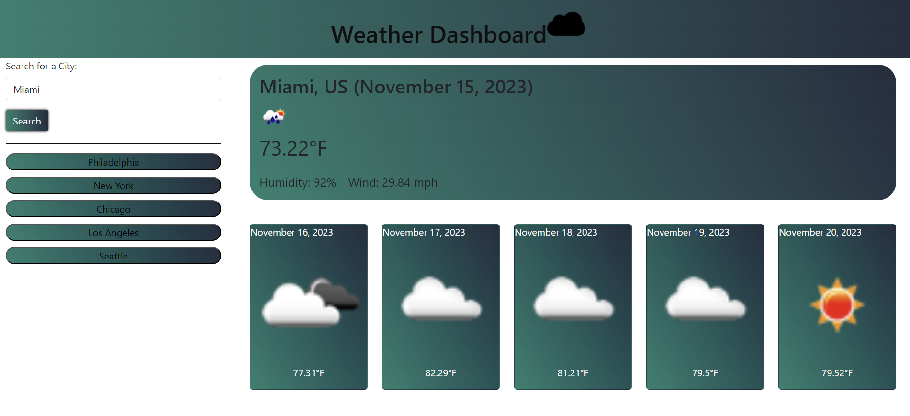

# Weather Dashboard

## Description

If you have been traveling a lot , you know how difficult it can be guess what weather is like in the city you travel to. Well , know there is solution to this problem. This site was created to show current and 5-day forecast for city of your choice. It uses OpenWeatherMap API to get the information on the weather, and then displays it to the page using dynamically created HTML elements, and Bootstrap as CSS framework. The website was made to be responsive on any device, so you could check the weather on the go. And if you ever wanted to save cities to check on them later, the website saves your five last searches.

## Installation

N/A

## Usage

Open 'index.html' in any browser, or follow this Git Pages link: [Weather Dashboard](https://aldu1n.github.io/weather-dashboard/). Search for the city to get current and 5-day weather forecast.

## Screenshot

## Credits

N/A

## License

N/A